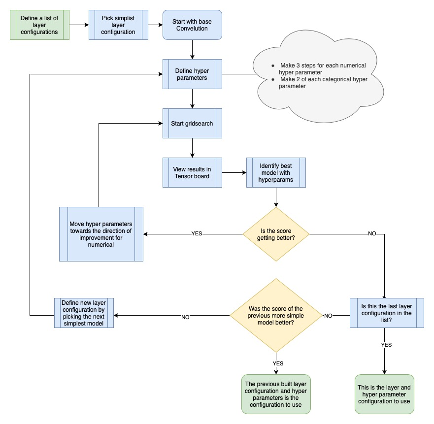
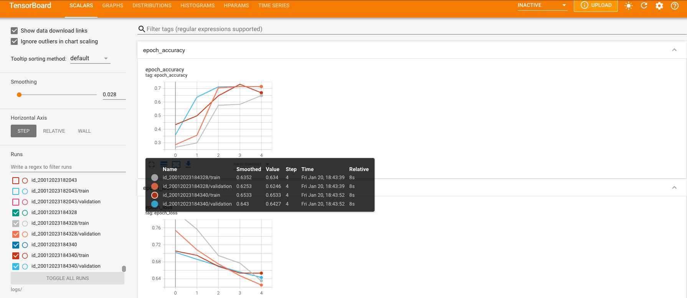
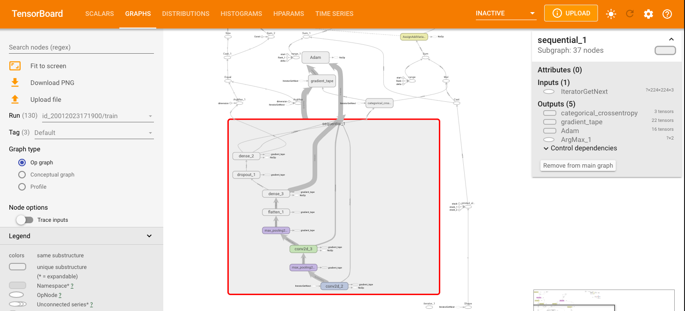
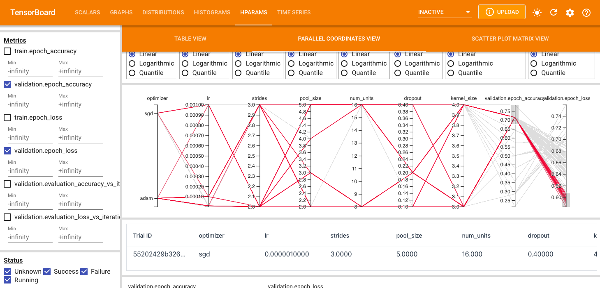

# CNN-Image-Classifier 👁️

This project utilizes a convolutional neural network (CNN) to classify objects within images. The code is implemented using TensorFlow and is designed to be easily adaptable for use in other image classification tasks.

Image objects are piped through transformer and formatters into the CNN input layer and training takes place.
Model and hyper-parameter performance analysis is done so using Tensorboard.

## Data

The images to be classified are put in the 'data' folder at the root level of the project.

Each class has its own folder within the data folder that contains images of the class object. The folder name will be inferred as the label for the class for the images in the folder.

## Evaluation

This project uses the Tensorboard for Evaluation of model performance and hyper-parameter optimization.

---

## Model Creation Workflow

---

## Tensorboard examples

#### Loss and Accuracy

#### Network Graph

#### Hyperparameter Optimization
